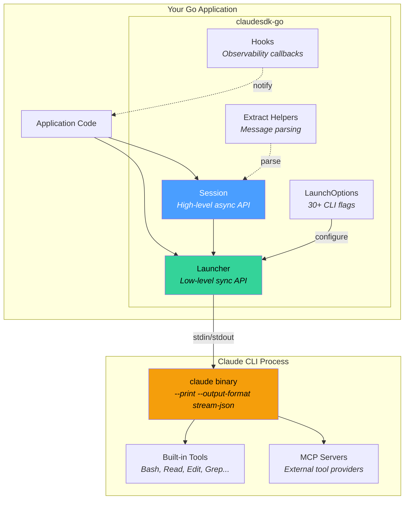
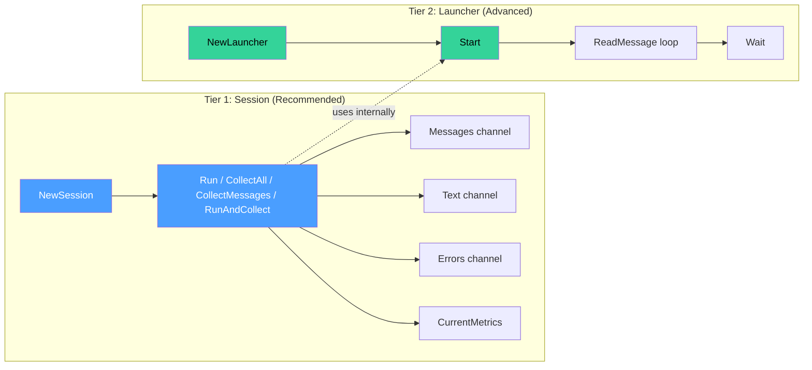
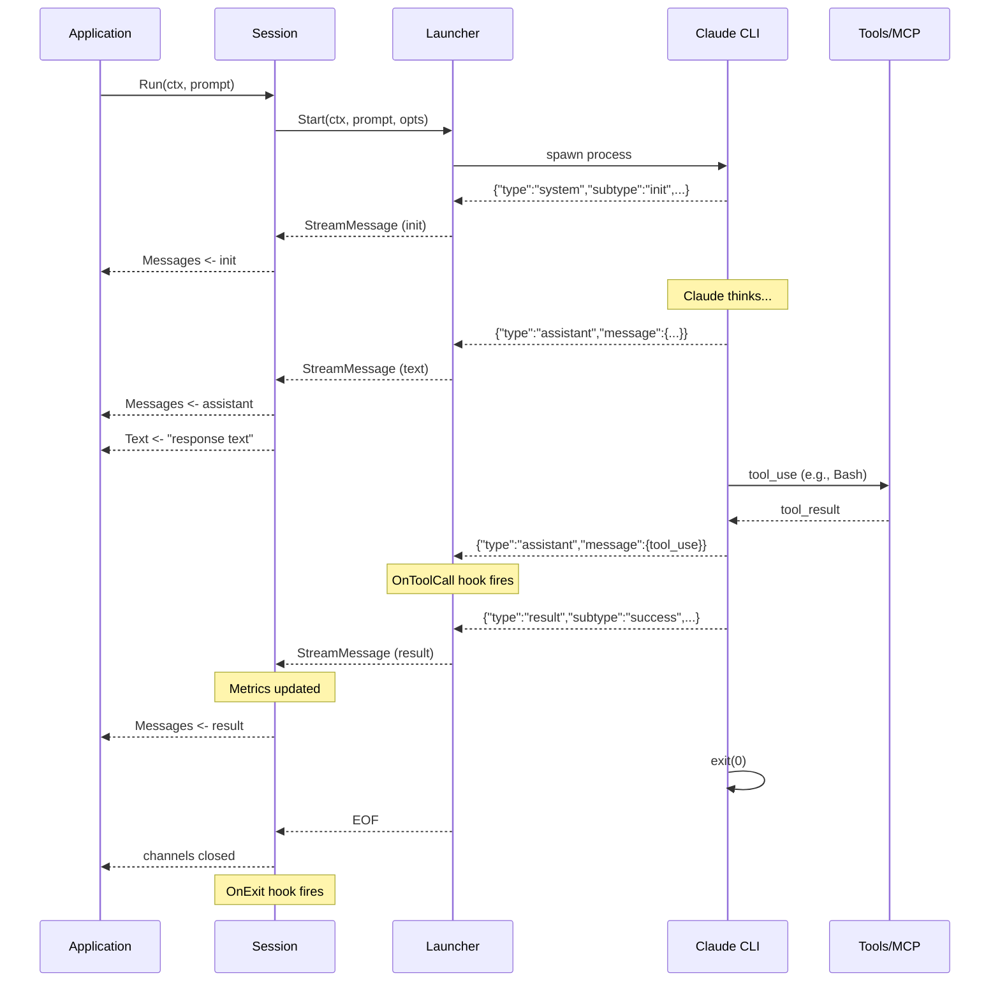
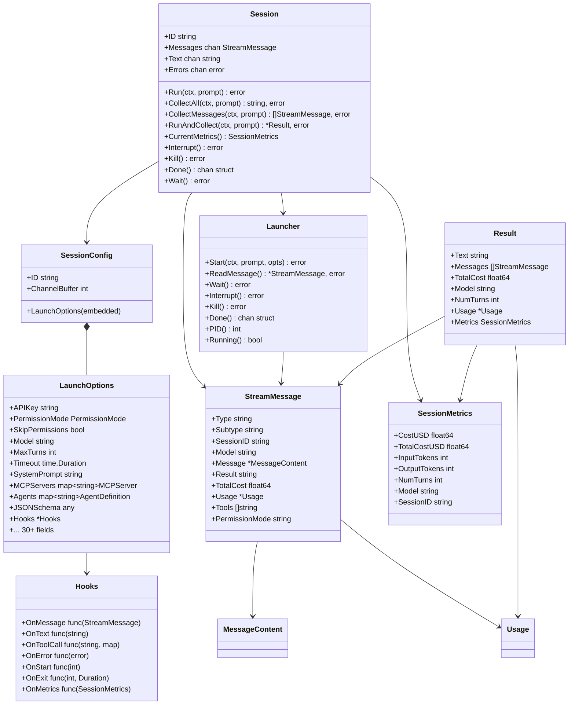
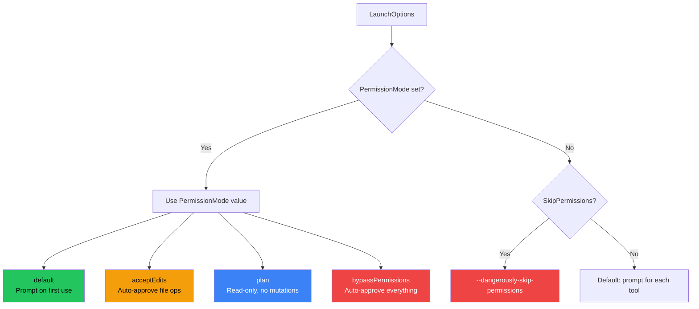
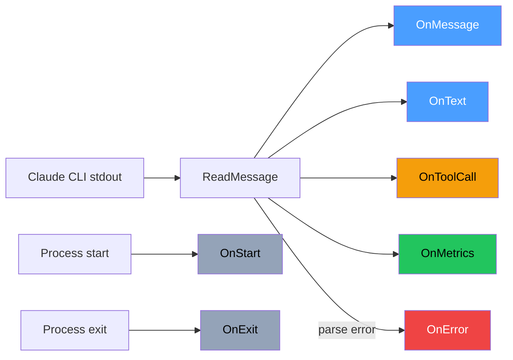
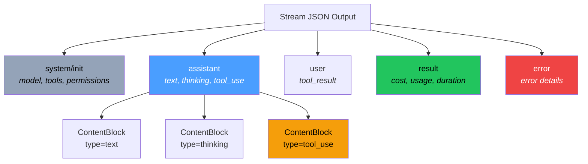
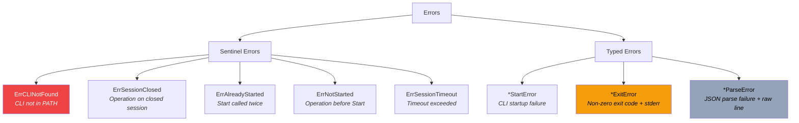

# claudesdk-go

A Go SDK for programmatically controlling [Claude Code CLI](https://docs.anthropic.com/en/docs/claude-code). Zero dependencies. Two-tier API. Real-time streaming.

```go
session, _ := claude.NewSession(claude.SessionConfig{
    LaunchOptions: claude.LaunchOptions{SkipPermissions: true},
})
text, _ := session.CollectAll(ctx, "What is the capital of France?")
fmt.Println(text) // "Paris"
```

## Table of Contents

- [Installation](#installation)
- [Requirements](#requirements)
- [Architecture](#architecture)
- [Quick Start](#quick-start)
- [API Tiers](#api-tiers)
- [Configuration](#configuration)
- [Hooks & Observability](#hooks--observability)
- [Real-Time Metrics](#real-time-metrics)
- [Message Types & Extraction](#message-types--extraction)
- [MCP Servers](#mcp-servers)
- [Custom Agents](#custom-agents)
- [Structured Output](#structured-output)
- [Permission Modes](#permission-modes)
- [Error Handling](#error-handling)
- [Examples](#examples)
- [Testing](#testing)
- [API Reference](#api-reference)

## Installation

```bash
go get github.com/MateoSegura/claudesdk-go
```

## Requirements

- Go 1.24+
- Claude CLI installed and in PATH (`npm install -g @anthropic-ai/claude-code`)

Verify with:

```go
if !claude.CLIAvailable() {
    log.Fatal("Claude CLI not found")
}
version, _ := claude.CLIVersion()
fmt.Println(version) // "2.1.23 (Claude Code)"
```

## Architecture

### System Overview



### Two-Tier API Design



### Message Flow



### Data Types



### Permission Flow



## Quick Start

### Simple Request-Response

```go
package main

import (
    "context"
    "fmt"
    "log"

    claude "github.com/MateoSegura/claudesdk-go"
)

func main() {
    claude.MustCLIAvailable()

    session, err := claude.NewSession(claude.SessionConfig{
        LaunchOptions: claude.LaunchOptions{
            SkipPermissions: true,
            MaxTurns:        1,
        },
    })
    if err != nil {
        log.Fatal(err)
    }

    text, err := session.CollectAll(context.Background(), "What is 2+2?")
    if err != nil {
        log.Fatal(err)
    }
    fmt.Println(text)
}
```

### Streaming with Hooks

```go
session, _ := claude.NewSession(claude.SessionConfig{
    LaunchOptions: claude.LaunchOptions{
        SkipPermissions: true,
        Hooks: &claude.Hooks{
            OnStart:    func(pid int) { fmt.Printf("[PID %d]\n", pid) },
            OnToolCall: func(name string, _ map[string]any) { fmt.Printf("[Tool: %s]\n", name) },
            OnMetrics:  func(m claude.SessionMetrics) {
                fmt.Printf("[Cost: $%.4f | Tokens: %d in, %d out]\n",
                    m.TotalCostUSD, m.InputTokens, m.OutputTokens)
            },
            OnExit: func(code int, d time.Duration) { fmt.Printf("[Exit %d in %s]\n", code, d) },
        },
    },
})

if err := session.Run(ctx, "Write a haiku about Go"); err != nil {
    log.Fatal(err)
}

for msg := range session.Messages {
    if text := claude.ExtractText(&msg); text != "" {
        fmt.Print(text)
    }
}
```

### Full Result with Metrics

```go
result, err := session.RunAndCollect(ctx, "Explain recursion in 3 sentences.")
if err != nil {
    log.Fatal(err)
}

fmt.Println(result.Text)
fmt.Printf("Model:    %s\n", result.Model)
fmt.Printf("Cost:     $%.6f\n", result.TotalCost)
fmt.Printf("Turns:    %d\n", result.NumTurns)
fmt.Printf("Duration: %s\n", result.Duration)
if result.Usage != nil {
    fmt.Printf("Tokens:   %d in / %d out\n", result.Usage.InputTokens, result.Usage.OutputTokens)
}
```

## API Tiers

### Session (High-Level, Recommended)

Session manages goroutines internally and exposes Go channels for async message consumption.

| Method | Returns | Description |
|--------|---------|-------------|
| `CollectAll(ctx, prompt)` | `string, error` | Blocks, returns text only |
| `CollectMessages(ctx, prompt)` | `[]StreamMessage, error` | Blocks, returns all messages |
| `RunAndCollect(ctx, prompt)` | `*Result, error` | Blocks, returns everything |
| `Run(ctx, prompt)` | `error` | Non-blocking, stream via channels |
| `CurrentMetrics()` | `SessionMetrics` | Thread-safe metrics snapshot |
| `Interrupt()` | `error` | SIGINT for graceful shutdown |
| `Kill()` | `error` | SIGKILL for forced termination |
| `Wait()` | `error` | Block until session ends |
| `Done()` | `<-chan struct{}` | Closed when session ends |

**Channels** (available after `Run`):

| Channel | Type | Description |
|---------|------|-------------|
| `session.Messages` | `chan StreamMessage` | All parsed messages |
| `session.Text` | `chan string` | Extracted text content |
| `session.Errors` | `chan error` | Non-fatal errors |

### Launcher (Low-Level, Advanced)

Launcher provides synchronous message reading and direct process control.

```go
launcher := claude.NewLauncher()
err := launcher.Start(ctx, "Explain Go interfaces", claude.LaunchOptions{
    SkipPermissions: true,
})
if err != nil {
    log.Fatal(err)
}
defer launcher.Wait()

for {
    msg, err := launcher.ReadMessage()
    if err != nil {
        log.Printf("parse error: %v", err)
        continue
    }
    if msg == nil {
        break // EOF
    }
    fmt.Print(claude.ExtractText(msg))
}
```

## Configuration

### LaunchOptions Reference

All fields map directly to Claude CLI flags.

#### Authentication

| Field | CLI Flag | Description |
|-------|----------|-------------|
| `APIKey` | `ANTHROPIC_API_KEY` env | API key for pay-as-you-go billing |

#### Permission & Security

| Field | CLI Flag | Description |
|-------|----------|-------------|
| `PermissionMode` | `--permission-mode` | `default`, `acceptEdits`, `plan`, `bypassPermissions` |
| `SkipPermissions` | `--dangerously-skip-permissions` | Bypass all prompts (shortcut for `PermissionBypass`) |
| `AllowDangerouslySkipPermissions` | `--allow-dangerously-skip-permissions` | Enable bypass as an option |
| `AllowedTools` | `--allowedTools` | Tools to auto-approve (supports globs) |
| `DisallowedTools` | `--disallowedTools` | Tools to remove entirely |
| `PermissionPromptTool` | `--permission-prompt-tool` | MCP tool for handling prompts |

#### Model & Budget

| Field | CLI Flag | Description |
|-------|----------|-------------|
| `Model` | `--model` | `"opus"`, `"sonnet"`, `"haiku"`, or full name |
| `FallbackModel` | `--fallback-model` | Fallback when primary is overloaded |
| `MaxBudgetUSD` | `--max-budget-usd` | Maximum spend per session |
| `MaxThinkingTokens` | `MAX_THINKING_TOKENS` env | Thinking token budget (default 31999, max 128000) |
| `Betas` | `--betas` | Beta features to enable |

#### System Prompt

| Field | CLI Flag | Description |
|-------|----------|-------------|
| `SystemPrompt` | `--system-prompt` | Replace default system prompt |
| `SystemPromptFile` | `--system-prompt-file` | Load system prompt from file |
| `AppendSystemPrompt` | `--append-system-prompt` | Append to default prompt (safest) |
| `AppendSystemPromptFile` | `--append-system-prompt-file` | Append from file |

#### Session Management

| Field | CLI Flag | Description |
|-------|----------|-------------|
| `Resume` | `--resume` | Resume session by ID or name |
| `Continue` | `--continue` | Continue most recent session |
| `ForkSession` | `--fork-session` | Fork instead of resume in-place |
| `SessionID` | `--session-id` | Use specific UUID |
| `NoSessionPersistence` | `--no-session-persistence` | Don't save to disk |

#### Tools & Agents

| Field | CLI Flag | Description |
|-------|----------|-------------|
| `Tools` | `--tools` | Restrict available tools |
| `Agents` | `--agents` | Define custom subagents (JSON) |
| `DisableSlashCommands` | `--disable-slash-commands` | Disable all skills |

#### Input/Output

| Field | CLI Flag | Description |
|-------|----------|-------------|
| `JSONSchema` | `--json-schema` | Request validated JSON output |
| `IncludePartialMessages` | `--include-partial-messages` | Include partial streaming events |
| `InputFormat` | `--input-format` | `"text"` or `"stream-json"` |

#### Environment

| Field | CLI Flag | Description |
|-------|----------|-------------|
| `WorkDir` | N/A (process cwd) | Working directory |
| `Env` | N/A (process env) | Additional environment variables |
| `MaxTurns` | `--max-turns` | Limit agentic turns |
| `Timeout` | N/A (context) | Session timeout |

#### MCP

| Field | CLI Flag | Description |
|-------|----------|-------------|
| `MCPServers` | `--mcp-config` | MCP server configurations |
| `StrictMCP` | `--strict-mcp-config` | Only use specified MCP servers |

#### Debug

| Field | CLI Flag | Description |
|-------|----------|-------------|
| `Debug` | `--debug` | Debug categories (e.g., `"api,mcp"`) |
| `Chrome` | `--chrome` / `--no-chrome` | Browser integration (tri-state via `BoolPtr`) |
| `AdditionalArgs` | N/A | Escape hatch for unsupported flags |

## Hooks & Observability

Hooks provide synchronous callbacks for monitoring without coupling to a logging framework.



| Hook | Signature | Fires When |
|------|-----------|------------|
| `OnStart` | `func(pid int)` | CLI process starts |
| `OnMessage` | `func(StreamMessage)` | Any message parsed |
| `OnText` | `func(text string)` | Text content extracted |
| `OnToolCall` | `func(name string, input map[string]any)` | Claude invokes a tool |
| `OnError` | `func(error)` | Non-fatal error (parse errors) |
| `OnExit` | `func(code int, duration time.Duration)` | CLI process exits |
| `OnMetrics` | `func(SessionMetrics)` | Result message with metrics |

All hooks are nil-safe. A nil `Hooks` pointer or nil individual hook is silently ignored.

## Real-Time Metrics

Metrics are available in two ways:

### Synchronous (Polling)

```go
// Thread-safe, call from any goroutine
metrics := session.CurrentMetrics()
fmt.Printf("Cost: $%.4f | Tokens: %d+%d\n",
    metrics.TotalCostUSD, metrics.InputTokens, metrics.OutputTokens)
```

### Asynchronous (Push)

```go
Hooks: &claude.Hooks{
    OnMetrics: func(m claude.SessionMetrics) {
        // Called when result message arrives
        log.Printf("Session %s: $%.4f, %d turns, %d+%d tokens",
            m.SessionID, m.TotalCostUSD, m.NumTurns,
            m.InputTokens, m.OutputTokens)
    },
}
```

### SessionMetrics Fields

| Field | Type | Description |
|-------|------|-------------|
| `CostUSD` | `float64` | Cost for this invocation |
| `TotalCostUSD` | `float64` | Accumulated session cost |
| `NumTurns` | `int` | Agentic turns completed |
| `InputTokens` | `int` | Total input tokens |
| `OutputTokens` | `int` | Total output tokens |
| `CacheCreationInputTokens` | `int` | Tokens used to create cache |
| `CacheReadInputTokens` | `int` | Tokens read from cache |
| `DurationMS` | `int64` | Total duration (ms) |
| `DurationAPIMS` | `int64` | API-only duration (ms) |
| `Model` | `string` | Model used |
| `SessionID` | `string` | CLI session UUID |

## Message Types & Extraction

### Stream Message Types



### Extraction Helpers

| Function | Returns | Description |
|----------|---------|-------------|
| `ExtractText(msg)` | `string` | First text content (any message type) |
| `ExtractAllText(msg)` | `string` | All text blocks concatenated |
| `ExtractThinking(msg)` | `string` | First thinking block |
| `ExtractAllThinking(msg)` | `string` | All thinking blocks concatenated |
| `ExtractTodos(msg)` | `[]TodoItem` | Parsed TodoWrite tool calls |
| `ExtractBashCommand(msg)` | `string` | Command from Bash tool call |
| `ExtractFileAccess(msg)` | `string` | File path from Read/Write/Edit |
| `ExtractAllFileAccess(msg)` | `[]string` | All file paths from message |
| `ExtractStructuredOutput(msg)` | `any` | JSON schema output from result |
| `ExtractUsage(msg)` | `*Usage` | Token usage from result |
| `ExtractInitTools(msg)` | `[]string` | Available tools from init |
| `ExtractInitPermissionMode(msg)` | `string` | Permission mode from init |

### Type Predicates

| Function | Description |
|----------|-------------|
| `IsResult(msg)` | Final result with metrics |
| `IsError(msg)` | Error message |
| `IsAssistant(msg)` | Claude's response |
| `IsSystem(msg)` | System message |
| `IsInit(msg)` | System init (first message) |
| `IsUser(msg)` | User/tool-result message |

### Tool Inspection

| Function | Returns | Description |
|----------|---------|-------------|
| `GetToolName(msg)` | `string` | First tool name in message |
| `GetToolCall(msg)` | `string, map[string]any` | First tool name + input |
| `GetAllToolCalls(msg)` | `[]ContentBlock` | All tool_use blocks |

## MCP Servers

Configure external tool providers via the Model Context Protocol.

```go
session, _ := claude.NewSession(claude.SessionConfig{
    LaunchOptions: claude.LaunchOptions{
        SkipPermissions: true,
        MCPServers: map[string]claude.MCPServer{
            // stdio transport (subprocess)
            "context7": {
                Command: "npx",
                Args:    []string{"-y", "@upstash/context7-mcp"},
            },
            // HTTP transport
            "my-api": {
                Type: "http",
                URL:  "https://api.example.com/mcp/",
                Headers: map[string]string{
                    "Authorization": "Bearer " + os.Getenv("API_TOKEN"),
                },
            },
        },
        StrictMCP: true, // Only use these servers, ignore others
    },
})
```

MCP configurations are written to a temp file and passed via `--mcp-config`. The temp file is automatically cleaned up when the process exits.

## Custom Agents

Define specialized subagents that Claude can invoke via the Task tool.

```go
session, _ := claude.NewSession(claude.SessionConfig{
    LaunchOptions: claude.LaunchOptions{
        SkipPermissions: true,
        Agents: map[string]claude.AgentDefinition{
            "security-reviewer": {
                Description: "Reviews code for security vulnerabilities",
                Prompt:      "You are a security expert. Focus on OWASP top 10...",
                Tools:       []string{"Read", "Grep", "Glob"},
                Model:       "sonnet",
            },
            "test-writer": {
                Description: "Writes comprehensive test suites",
                Prompt:      "You are a testing expert. Write table-driven tests...",
                Tools:       []string{"Read", "Write", "Bash"},
            },
        },
    },
})
```

## Structured Output

Request validated JSON output matching a schema.

```go
session, _ := claude.NewSession(claude.SessionConfig{
    LaunchOptions: claude.LaunchOptions{
        SkipPermissions: true,
        JSONSchema: map[string]any{
            "type": "object",
            "properties": map[string]any{
                "answer":     map[string]any{"type": "string"},
                "confidence": map[string]any{"type": "number", "minimum": 0, "maximum": 1},
            },
            "required": []string{"answer", "confidence"},
        },
    },
})

result, _ := session.RunAndCollect(ctx, "What is the speed of light?")
if result.StructuredOutput != nil {
    data := result.StructuredOutput.(map[string]any)
    fmt.Printf("Answer: %s (confidence: %.0f%%)\n",
        data["answer"], data["confidence"].(float64)*100)
}
```

## Permission Modes

```go
// Default: prompt for each tool
claude.LaunchOptions{PermissionMode: claude.PermissionDefault}

// Auto-approve file operations (Read, Write, Edit)
claude.LaunchOptions{PermissionMode: claude.PermissionAcceptEdits}

// Read-only: no file mutations or command execution
claude.LaunchOptions{PermissionMode: claude.PermissionPlan}

// Auto-approve everything (use with caution)
claude.LaunchOptions{PermissionMode: claude.PermissionBypass}

// Granular: allow specific tools without prompts
claude.LaunchOptions{
    AllowedTools: []string{
        "Read",
        "Bash(git log *)",
        "Edit(./src/**)",
    },
}
```

## Error Handling

### Error Types



```go
result, err := session.RunAndCollect(ctx, prompt)
if err != nil {
    switch {
    case errors.Is(err, claude.ErrCLINotFound):
        log.Fatal("Install Claude CLI: npm install -g @anthropic-ai/claude-code")
    case errors.Is(err, claude.ErrSessionTimeout):
        log.Print("Session timed out, partial results available")
    default:
        var exitErr *claude.ExitError
        if errors.As(err, &exitErr) {
            log.Printf("Claude exited with code %d: %s", exitErr.Code, exitErr.Stderr)
        }
    }
}
```

## Examples

Three complete examples are included in the `examples/` directory:

### `examples/simple/`

Minimal request-response using `CollectAll`.

```bash
go run ./examples/simple/
go run ./examples/simple/ "Your custom prompt here"
```

### `examples/streaming/`

Real-time streaming with hooks for observability.

```bash
go run ./examples/streaming/
```

### `examples/tools/`

Multi-tool session with MCP server integration and colored output.

```bash
go run ./examples/tools/
```

## Testing

### Run Unit Tests

```bash
go test -short -v ./...
```

Unit tests cover:
- CLI argument construction (`buildArgs`) with all 30+ flag combinations
- Message extraction helpers (text, thinking, todos, tool calls, structured output)
- JSON parsing of all message types (init, assistant, result, error)
- Metrics extraction and nil-safety
- Hook nil-safety and invocation
- Error types and sentinel errors
- Type constructors and helpers

### Run Integration Tests

Requires Claude CLI installed and authenticated.

```bash
go test -v -run TestIntegration -timeout 10m ./...
```

Integration tests verify:
- Simple prompt/response (`What is 2+2?`)
- `RunAndCollect` with full metrics (model, cost, tokens, session ID)
- System prompt replacement (`PING` -> `PONG`)
- Append system prompt
- `MaxTurns` enforcement
- Streaming with all hooks firing
- `CollectMessages` with init message inspection
- Permission mode verification via init message

## API Reference

### Package Functions

```go
// CLI availability
func CLIAvailable() bool
func CLIVersion() (string, error)
func MustCLIAvailable()

// Extraction helpers
func ExtractText(msg *StreamMessage) string
func ExtractAllText(msg *StreamMessage) string
func ExtractThinking(msg *StreamMessage) string
func ExtractAllThinking(msg *StreamMessage) string
func ExtractTodos(msg *StreamMessage) []TodoItem
func ExtractBashCommand(msg *StreamMessage) string
func ExtractFileAccess(msg *StreamMessage) string
func ExtractAllFileAccess(msg *StreamMessage) []string
func ExtractStructuredOutput(msg *StreamMessage) any
func ExtractUsage(msg *StreamMessage) *Usage
func ExtractInitTools(msg *StreamMessage) []string
func ExtractInitPermissionMode(msg *StreamMessage) string

// Tool inspection
func GetToolName(msg *StreamMessage) string
func GetToolCall(msg *StreamMessage) (string, map[string]any)
func GetAllToolCalls(msg *StreamMessage) []ContentBlock

// Type predicates
func IsResult(msg *StreamMessage) bool
func IsError(msg *StreamMessage) bool
func IsAssistant(msg *StreamMessage) bool
func IsSystem(msg *StreamMessage) bool
func IsInit(msg *StreamMessage) bool
func IsUser(msg *StreamMessage) bool

// Helpers
func BoolPtr(v bool) *bool
```

### Constants

```go
const Version = "0.2.0"
const DefaultBinary = "claude"

// Permission modes
const PermissionDefault     PermissionMode = "default"
const PermissionAcceptEdits PermissionMode = "acceptEdits"
const PermissionPlan        PermissionMode = "plan"
const PermissionBypass      PermissionMode = "bypassPermissions"
```

### Sentinel Errors

```go
var ErrCLINotFound     = errors.New("claude: CLI not found in PATH")
var ErrSessionTimeout  = errors.New("claude: session timeout exceeded")
var ErrSessionClosed   = errors.New("claude: session is closed")
var ErrAlreadyStarted  = errors.New("claude: launcher already started")
var ErrNotStarted      = errors.New("claude: launcher not started")
```

## License

See [LICENSE](LICENSE) for details.
